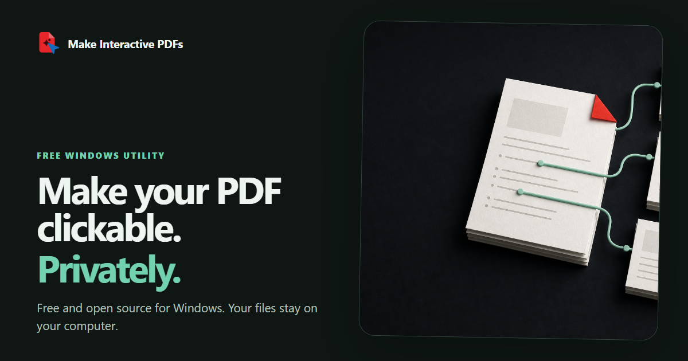
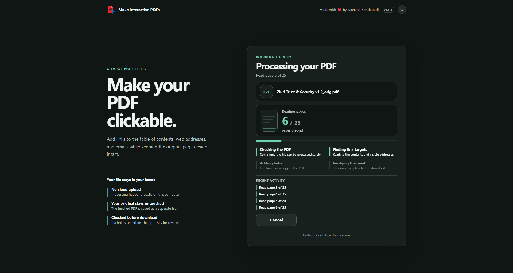

<p align="center">
  <a href="https://sk-zluri.github.io/make-interactive-pdfs/">
    
  </a>
</p>

# Make Interactive PDFs

Make Interactive PDFs is a free, open-source Windows utility that adds useful links to PDFs while keeping the files on your computer.

It can add:

- Page jumps from tables of contents, agendas, indexes, and similar page-reference lists
- Clickable web addresses and email addresses
- Local OCR for scanned pages that genuinely need it
- A verified, separate output PDF without changing the original

**[Visit the website](https://sk-zluri.github.io/make-interactive-pdfs/)** · **[Download the latest release](https://github.com/sk-zluri/make-interactive-pdfs/releases/latest)** · **[Report an issue](https://github.com/sk-zluri/make-interactive-pdfs/issues)**

## Download for Windows

1. Open the [latest release](https://github.com/sk-zluri/make-interactive-pdfs/releases/latest).
2. Download `Make.Interactive.PDFs.zip`.
3. Extract the entire ZIP folder.
4. Double-click `Make Interactive PDFs.exe`.
5. Keep the small desktop controller open while using the workspace in Chrome.

The app is not code-signed yet, so Windows may show a SmartScreen warning. Only continue if you downloaded it from this repository's official Releases page.

## See it working

<p align="center">
  
</p>

The progress view shows what the app is checking, which page it is reading, and when OCR is actually needed.

## Private by design

Your PDF is processed locally. It is not uploaded to a cloud service.

- No account or sign-up
- The original PDF stays untouched
- The finished PDF is saved as a separate copy
- Temporary working files are removed locally

## Smart, selective OCR

The app uses a PDF's existing selectable text whenever that text is healthy, even when a scanned image sits behind it. Local OCR runs only on pages where text is missing or unusable, plus a small targeted margin check when a page number needs confirming. Blank pages are skipped.

OCR helps the app understand a page and position links. It does not redraw the page or turn every scanned word into selectable text.

## What “interactive” means here

This project currently adds:

- Internal page-jump links
- Clickable web links
- Clickable email links

It does not add form fields, audio, video, or other rich-media features.

## Safeguards and current limits

- Processes one PDF at a time, up to 512 MB
- Does not modify password-protected PDFs
- Does not modify digitally signed PDFs, because editing would invalidate the signature
- If some entries are unclear, the app offers **Create with verified links**. It makes a separate copy containing only links the app can confirm; unclear entries are left untouched, and the added links are verified before download.
- Ships as an unsigned portable Windows app rather than an installer

## Run from source

Python 3.11 is recommended.

```powershell
git clone https://github.com/sk-zluri/make-interactive-pdfs.git
cd make-interactive-pdfs

py -3.11 scripts\run_isolated.py self-test
.\.venv\Scripts\python.exe -m pip --isolated --disable-pip-version-check install -r requirements-app.txt
.\.venv\Scripts\python.exe -m interactive_pdf_app
```

## Tests

```powershell
.\.venv\Scripts\python.exe -m unittest tests.app_test -v
.\.venv\Scripts\python.exe scripts\run_isolated.py --venv-dir .venv self-test
.\.venv\Scripts\python.exe scripts\run_isolated.py --venv-dir .venv regression-test
```

## Licence

The project source is available under the [MIT Licence](LICENSE). Bundled third-party components retain their respective licences; see [Third-party notices](THIRD_PARTY_NOTICES.md).

## Creator

Made with ❤️ by [Sashank Kondepudi](https://www.linkedin.com/in/techhfreakk).
